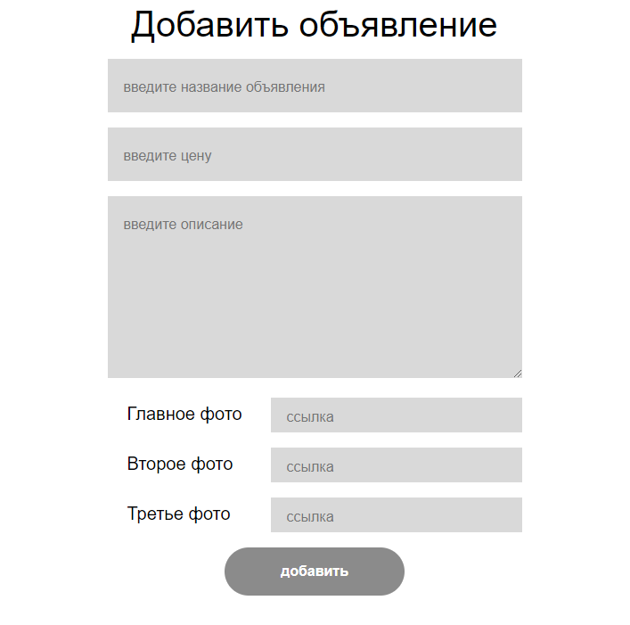

#Тестовое задание "Парсер бюллетеней"
___
##Задача
___
Необходимо создать сервис для хранения и подачи объявлений. Объявления должны храниться в базе данных. Сервис должен предоставлять API, работающее поверх HTTP в формате JSON.
##Решение
____
###Набор методов для работы с данными API
____
+ __/api/V1/bulletins__ - GET метод, который выводит список всех объявлений и номера страниц;
+ __/api/V1/bulletins/{id}__ - GET метод, который выводит конкретное объявление, после указание его __id__;
+ __/api/V1/bulletins__ - POST метод, который добавляет новое объявление;

>Принимает такие поля, как:
>> + title (название объявления);
>> + price (цена, за товар);
>> + description (описание товара);
>> + general_photo(главная фотография товара);
>> + photos(массив, который принимает в себя до 2х фотографий);

+ __/api/V1/bulletins/price/low-high__ - GET метод, который выводит отсортированные объявления по цене(по возрастанию);
+ __/api/V1/bulletins/price/high-low__ - GET метод, который выводит отсортированные объявления по цене(по убыванию);
+ __/api/V1/bulletins/date/low-high__ - GET метод, который выводит отсортированные объявления по дате(по возрастанию);
+ __/api/V1/bulletins/date/high-low__ - GET метод, который выводит отсортированные объявления по дате(по убыванию);
###Дизайн парсера
____
####Страница просмотра бюллетени

####Страница просмотра всех бюллетеней(в моем случае я продовал пиджаки)

####Страница добавления объявления

###Сборка Docker
____
+ nginx
+ mysql
+ php
+ laravel
##Заключение
____
Благодаря этому парсеру вникся чуть чуть в рабочий процесс, в котором есть свои сроки. Я взял достаточный опыт, но некоторые задачи остались для меня затрудненными, поэтому если вы захотите запустить парсер на ___docker-compose up -d___
, то да, у вас это получится но, ajax с ним не работает. Было принято решение перенести проект на OpenServer и на нём закончить сайт.
Если это заключение всё ещё висит, значит я не нашел решение данной проблемы, если оно у вас есть, то буду очень признателен. Во всём остальном работай
сам доволен и опыт бесценен. Буду идти дальше!
